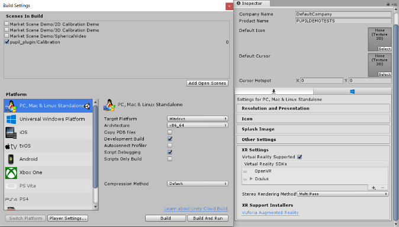
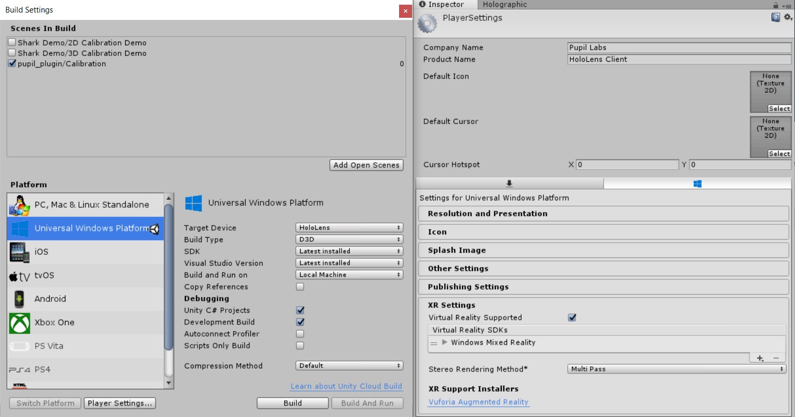
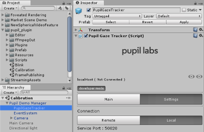
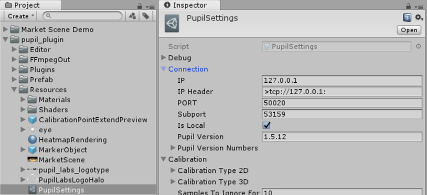
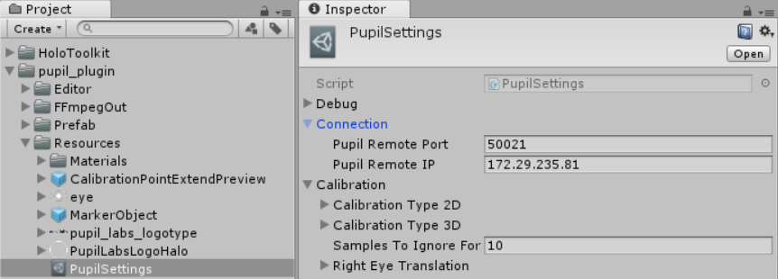
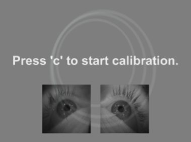
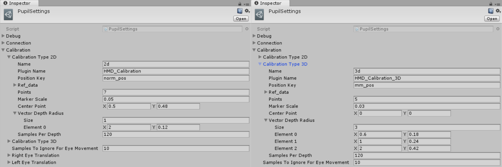
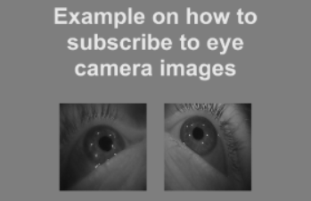
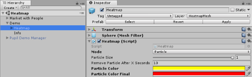
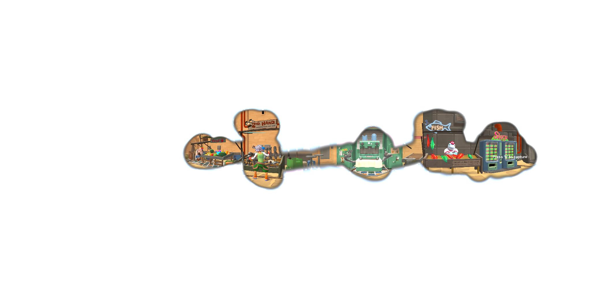

# Developer Documentation


## Setup 
This section of the docs will show you how to set up your development environment in Unity3D so that you can work with Pupil + Unity.

Note that there are difference in the setup for VR and HoloLens.


### VR Build and Player Settings




The software has been tested for both Oculus and OpenVR SDKs. Please make sure to select the correct SDK for your headset. 

### HoloLens Build and Player Settings



The `Build Settings` debugging option `Unity C# Projects` will allow you to debug the code at runtime while deploying to HoloLens. As this is not supported by Unity's own MonoDevelop IDE, you will need Visual Studio for this step. As an alternative debugging option, Unity's `Holographic Emulation` is also supported. 

As for the Player Settings, make sure the following `Capabilities` are enabled under `Publishing Settings` 

- InternetClient
- PrivateNetworkClientServer
- Microphone
- SpatialPerception

### Adding Pupil to Existing Projects

As part of new releases, HMD-Eyes provides what is called `Unity Package` assets
- `Pupil.Import.Package.VR.unitypackage`
- `Pupil.Import.Package.HoloLens.unitypackage`

To import either one in Unity, select `Assets/Import Package/Custom Package...` and navigate to where you downloaded the file to. You are presented with a dialog to choose from the files included in the package. Press `Import` to import all of them. This will create a new folder named `pupil_plugin` in your project structure including all necessary scripts and assets to integrate eye tracking with your own project.
Use the demo scenes included in the Unity projects described here as an example on how to get started.

### Communicating with Pupil

The Unity scene `pupil_plugin/Calibration.unity`, which is included in both projects, serves as a starting point for VR and HoloLens development. Use it to test connecting to Pupil.

#### VR Settings

1. `Local` vs `Remote` - Select the `PupilGazeTracker` gameobject to access the custom Inspector GUI. `Local` is used to communicate with Pupil Capture/Service when the Unity project and Pupil software are running on the same machine. `Remote` is used to communicate with Pupil Capture/Service running on another machine over the network. 
    
1. `IP` and `Port` - `PupilSettings`, which is located in `pupil_plugin/Resources` is used to save global settings that are not specific to a scene. Select `Connection`, which lets you set both the IP (in case of Pupil running remotely) as well as the port over which to communicate. If the standard port of 50020 does not work for you, please set an alternative here and also make sure that the same port is set in Pupil Capture (more on that, later).



#### HoloLens Settings

1. `UDP` - Pupil Capture/Service does not run natively on HoloLens/UWP. Pupil Capture/Service must run on a remote PC. The `PupilGazeTracker` gameobject includes an additional component called `UDP Communication`. A secondary port (named `Editor Mode UDP Port`) can be set. It is required if you use `Holographic Emulation` and (at least on Windows machines) needs to be different from the main port. 
    
1. `IP` and `Port` - The HoloLens implementation relies on UDP to communicate data between the Unity plugin and Pupil Capture/Service. Select `PupilSettings` in the `Project` tab and set the IP of the PC Pupil is running on under `Connection`. Please also make sure the port set here corresponds with the one you set in the `HoloLens Relay` plugin in Pupil Capture. 



## Calibration 

In order to know what someone is looking at in the scene, we must to establish a mapping between pupil and gaze positions. This is what we call calibration. The calibration process establishes a mapping from pupil to gaze coordinates.

Once the communication between Unity and Pupil Capture/Service has been established, you are ready to calibrate. Before you calibrate you will need to ensure that the calibration pattern is displayed within your FOV and that eyes are well captured.



- Calibration area - Set the extent of the calibration area. A circle indicates the extent of the calibration area. You should set the circle radius so that it covers as much of our FOV as possible. (Note you will see 2 circles for a 3d calibration and one circle for a 2d calibration). 
- Eye images - Check that you are capturing a good image of the eye. You may need to adjust the headset to ensure you can see the eye in all ranges of eye movements. To disable this feature, select the `Pupil Manager` and toggle the `Display Eye Images` checkmark

### Calibration Settings 

The positioning of the calibration marker is very important, as it is used as a reference for the Pupil eye tracking algorithms. If you are having trouble with the accuracy, try adapting the calibration settings:

Go to `pupil_plugin/PupilSettings` and select `Calibration` 
 


- `Points` defines the number of points per circle, the first being in the center of it. 
- `Marker Scale` determines the size of the calibration marker on screen 
- `Center Point` allows you to shift the calibration point center in x and y direction. This can be helpful if, due to how the VR headset sits on your head, the center for the eyes differs from the center of the display. For 2D calibration, the center point values are interpreted as viewport coordinates
- `Vector Depth Radius` can be adapted to define the dimension of the circle 
	- 2D calibration - Depth translates to the distance from the camera at which marker is placed. Radius defines the distance from the center point (in viewport space).
    - 3D calibration - In this mode we calibrate at multiple depths. The default settings are distances of `0.6`, `1`, and `2`. Radius defines the XY distance from the current center point (0,0,Depth).
- `Samples Per Depth` defines the amount of calibration points recorded for each marker position. We reduced this number for 3D calibration to a third of the samples of 2D calibration so that the duration of the calibration is equivalent for both modes. 
- `Samples To Ignore For Eye Movements` defines how much time the user is expected to need to move from one calibration marker position to the next. During this period, the gaze positions will not be recorded. 

### Calibration marker visualization of pupil detection confidence 

During calibration, the marker color will visualize pupil detection confidence. 
- White = high confidence pupil detecton for both eyes
- Red = low confidence pupil detection for both eyes. 
- Confidence visualization per eye:
    - Right eye (eye ID 0) -  Low confidence = pink. High confidence = white. The marker will gradually become pink if confidence drops for this eye. 
    - Left eye (eye ID 1) - Low confidence = yellow. High confidence = white. The marker will gradually become yellow if confidence drops for this eye.  

### Calibration Success/Failure 

When the calibration process is complete, all reference points are sent to Pupil software. Pupil software will respond with a `success` or `failure` message.

- Success - `Pupil Manager` will load your scene with gaze visualization. 
- Failure - If the calibration fails, it is often due to low confidence pupil detection. Use Pupil Capture to check for both eyes when the user is wearing the HMD. Unity accepts gaze data with a confidence level greater than `0.6`. You may need to adjust the HMD in order to capture a good view of the user's eyes. The console in Unity will also provide feedback for diagnostics.

## Pupil Manager 

The `Pupil Manager` gameobject creates a GUI in Unity that will assist you through the connection and calibration process.

`Pupil Manager`'s script listens for Pupil events (e.g. connection established/quit, calibration start, calibration success/failure) and is used to launch events in the scene. For example, a successful calibration will trigger a scene to load.

### Pupil Manager Prefab

The Market demos as well as the `Calibration` scene contain `Pupil Manager`. `Pupil Manager` is also available as Unity prefab so that it can easily be added to new scenes. Goto `pupil_plugin/Prefabs`

If you use the prefab for your own scene, please specify the scene/scenes you want to load in the Inspector GUI for `Pupil Manager`
- Add the name to the `Available Scenes` list
- Set the `Current Scene Index` to the corresponding index
- For Unity to be able to find the scene, it also needs to be added to `File/Build Settings/Scenes In Build`
- Scenes are loaded as additional content, so the `Pupil Manager` will still be available
	- If you have to re-do the calibration after a scene has been loaded, just press 'c' (in case of VR) or use the GUI to do so (on HoloLens)

`Pupil Manager` is also parent to a camera gameobject, which is used during the calibration process, only, and deactivated once the calibration has been successful. Once your custom scene is loaded, please point `PupilSettings.Instance.currentCamera` to the camera you are using (e.g. `Camera.main`).


## Accessing Data 

The first step to be able to access Pupil data is to subscribe to a topic.

```c#
PupilTools.SubscribeTo(string topic)
```

Once messages on a subscribed topic are available, the receiving socket is polled (`Connection.cs`, [line 199](unity_pupil_plugin_vr/Assets/pupil_plugin/Scripts/Networking/Connection.cs#L199))

```c#
if (subscriptionSocketForTopic [keys [i]].HasIn)    // key[i] being the 'topic' 
    subscriptionSocketForTopic [keys [i]].Poll ();
```

Message interpretation is handled inside the code block starting in [line 127](unity_pupil_plugin_vr/Assets/pupil_plugin/Scripts/Networking/Connection.cs#L127) of `Connection.cs`

```c#
subscriptionSocketForTopic\[topic\].ReceiveReady += (s, a) =>
```

### `Gaze` Topic (available after successful calibration)

After a successful calibration, `gaze` topic messages will be received. These messages contain dictionaries. These dictionaries are deserialized using the `MessagePackSerializer` classes ([line 167](unity_pupil_plugin_vr/Assets/pupil_plugin/Scripts/Networking/Connection.cs#L167), `Connection.cs`) and stored to `PupilTools.gazeDictionary`

```c#
var dictionary = MessagePackSerializer.Deserialize<Dictionary<string,object>> (mStream);  
var confidence = PupilTools.FloatFromDictionary(dictionary,"confidence");  
[..]  
if (confidence > 0.6f && msgType == "gaze")   
    PupilTools.gazeDictionary = dictionary;
```

Changes to `gazeDictionary` trigger 

```c#
PupilTools.UpdateGaze()
```

which goes through the data, storing relevant information (e.g. the gaze positions) through 

```c#
PupilData.AddGazeToEyeData(string key, float[] position)
```
Based on the chosen calibration type, this can either be 2D or 3D. To access the data, use 

- `PupilData._2D.LeftEyePosition`, `PupilData._2D.RightEyePosition` or `PupilData._2D.GazePosition`, which will provide the current viewport coordinates in camera space for the respective eye (used e.g. for the three colored markers) 

- `PupilData._2D.GetEyePosition (Camera sceneCamera, string eyeID)`, which will apply an additional frustum center offset for each eye (used e.g. for the shader implementations) 

- `PupilData._3D.GazePosition`, which contains the camera relative gaze position 

Working with 2D calibration and viewport coordinates, Unity provides methods to translate these to 3D space, e.g. `PupilMarker.UpdatePosition(Vector2 newPosition)`, line 56 

```c#
gameObject.transform.position = camera.ViewportToWorldPoint(position); 
```

An alternative is used by the laser pointer implementation in the `2D Calibration Demo` scene `MarketWith2DCalibration.Update()`, line 63 

```c#
Ray ray = sceneCamera.ViewportPointToRay(viewportPoint); 
```

This solutions requires the use of Unity Colliders, though, which, when hit by the above defined ray, return the 3D hit point position. 

### Topics that do not require calibration 

We include three demo scenes that exemplify subscribing to topics to get data for which no calibration is required
- `Blink`,
- `Frame Publishing` (short description below) and 
- `Pupil`, for which we will go into more detail, here: 

One of the most often asked for examples is getting values for pupil diameter.  The steps involved (taken from [`PupilDemo.cs`](unity_pupil_plugin_vr/Assets/pupil_plugin/Scripts/PupilDemo.cs)) are as follows

- `PupilTools.SubscribeTo("pupil.")`, to subscribe to both eyes

Once data is being sent

```c#
CustomReceiveData(string topic, Dictionary<string,object> dictionary, byte[] thirdFrame = null)
```
will be called to interpret the result

```c#
if (topic.StartsWith ("pupil") )
{
	foreach (var item in dictionary)
	{
		switch (item.Key)
		{
		case "topic":
		case "method":
		case "id":
			var textForKey = PupilTools.StringFromDictionary (dictionary, item.Key);
			// Do stuff
			break;
		case "confidence":
		case "timestamp":
		case "diameter":
			var valueForKey = PupilTools.FloatFromDictionary (dictionary, item.Key);
			// Do stuff
			break;
```	

There are multiple subtopics included in the dictionary and as "diameter" is of type `float`, we need to call the following method to get the actual value

```
PupilTools.FloatFromDictionary(Dictionary<string,object> source, string key)
```

The script implementation is based on the values you receive for 2D capturing mode. Have a look at [the documentation](https://github.com/pupil-labs/pupil-docs/blob/master/user-docs/data-format.md#looking-at-the-data) to see the additional values available in 3D mode
	
## Recording Data

The Unity VR plugin allows to trigger recordings in Pupil Capture (Pupil Service does not support this feature). Recordings can be started through the interface GUI of `PupilGazeTracker` or by pressing the 'R' key (in either case only once a connection has been established). On the plugin side of things, two additional processes are started
- a screen recording, saving the current view to a video file 

- saving Pupil gaze data and their corresponding Unity positions in CSV format using this structure
	- `Timestamp,Identifier,PupilPositionX,PupilPositionY,PupilPositionZ,UnityWorldPositionX,UnityWorldPositionY,UnityWorldPositionZ`

The resulting files are saved to the path set in `PupilSettings/Recorder/File Path`. You can change it manually, there, or through the `PupilGazeTracker` Inspector GUI under `Settings` by activating `CustomPath` and clicking the `Browse` button.

## Demo Scenes 

Here a short description of the included examples and what should be visible on screen.

### Calibration 

This scene will display three colored markers representing the left eye (green), right (blue), and center point (red). If you have a well calibrated system, then the markers should be very close to each other.


### Blink 

This demo logs blink events to the Unity console. This demo does not require calibration as it only uses pupil data (not gaze data).

This scene demonstrates how to  subscribe to a topic and read data from the socket, start/stop a Pupil plugin, to subscribe and un-subscribe from a topic (e.g. `blinks`), and how to receive a dictionary from Pupil in Unity. 

### Frame Publishing

This demo scene shows how to communicate with Pupil and access eye video frames



### Pupil

This example shows you how to subscribe to `pupil.` topics and how to interpret the dictionary that you will receive from Pupil software in Unity.

### VR - 2D/3D Calibration Demo

These scenes will display a 3D market scene, based on Unity assets available for free on the [Asset Store](https://assetstore.unity.com/packages/essentials/tutorial-projects/adventure-sample-game-76216). 

While the 3D calibration scene only includes a simple white marker visualization, the 2D calibration pendant includes the three colored variant used in the Calibration demo scene and two additional visualizations 

- A laser pointer going to the center of your gaze (depicted on the left) 

- A shader-based implementation that grays out the area around each of the eyes position (right) 

	 

### HoloLens - 2D/3D Calibration Demo 

As it is not a common use-case for HoloLens to visualize complete scenes, we reduced the market scene to a single object - the `sharkman` - for the user to look at. 

### Spherical Video demo

Load and display a 360 degree video based on Unity's 2017.3 implementation. Combined with Pupil, this allows to visualize what the user is looking at. 

### Heatmap demo

This demo shows how to generate and export sperical videos or still images with heatmaps generated from gaze postions.

Gaze positions are visualized as particles on a spherical texture that is overlayed on the 3d scene. 

After calibration, press `h` to start recording the output video or to capture the current view to an image. The output path is the same as the path defined by the settings for PupilGazeTracker recordings. 



- Mode 
	- `Particle` will color the area the user is looking at 
	- `ParticleDebug` will make the hetamap visible for the user wearing the HMD as well as the operator. 
	- `Highlight` will only fill-in the area looked at 
	    
	- `Image` will keep all particles and color code them based on the time of creation 
	    
	- `Particle Size` - The size of a single particle used to visualize each gaze position 
	- `Remove Particle After X Seconds` - Set how many seconds a particle should be visualized (not used for Image mode) 
	- `Particle Color` - The color of the particle in the visualization 
	- `Particle Color Final` - Color for oldest particle in Image mode. Every color in between will be interpolated 
	
The heatmap is available as Prefab, and can be added to existing scenes by dragging it onto the main camera of that scene.
