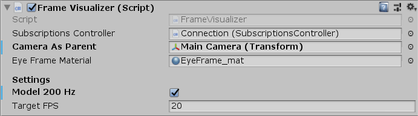
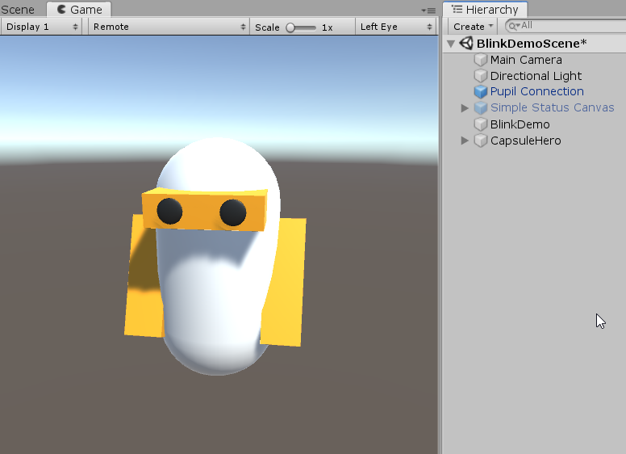
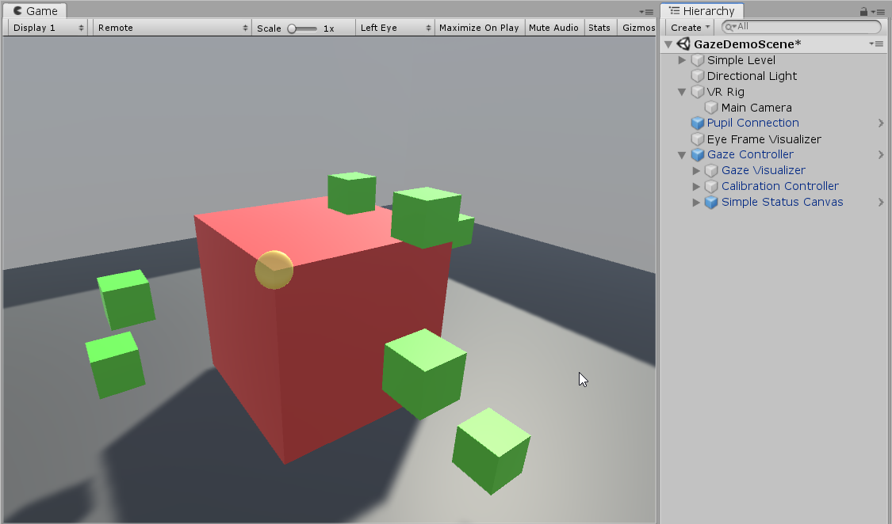

# Developer Documentation

* [Getting Started](#getting-started)
  + [Pupil Capture or Pupil Service](#pupil-capture-or-pupil-service)
  + [Dependencies](#dependencies)
  + [VR Build and Player Settings](#vr-build-and-player-settings)
  + [Adding hmd-eyes to Existing Projects](#adding-hmd-eyes-to-existing-projects)
  + [Next Steps](#next-steps)
* [Plugin Overview](#plugin-overview)
* [Connection to Pupil Capture/Service](#connection-to-pupil-captureservice)
    - [RequestController](#requestcontroller)
    - [SubscriptionsController](#subscriptionscontroller)
* [Accessing Data](#accessing-data)
  + [Low-level data acess](#low-level-data-acess)
  + [Pupil Data](#pupil-data)
  + [Gaze Data](#gaze-data)
* [Gaze Tracking](#gaze-tracking)
  + [Calibration](#calibration)
    - [Calibration Settings and Targets](#calibration-settings-and-targets)
    - [Calibration Success/Failure](#calibration-success-failure)
  + [Accessing Gaze Data](#accessing-gaze-data)
    - [Gaze Mapping Context](#gaze-mapping-context)
    - [GazeDirection + GazeDistance instead of GazePoint3d](#gazedirection--gazedistance-instead-of-gazepoint3d)
  + [Mapping Gaze Data](#map-gaze-data-to-vr-world-space)
* [Utilities](#utilities)
  + [Default Gaze Visualizer](#default-gaze-visualizer)
  + [Time Conversion](#time-conversion)
  + [Recording Data](#recording-data)
    - [Recording Path](#recording-path)
  + [Remote Annotations](#remote-annotations)
  + [Screencast](#screencast)
  + [Display Eye Images](#display-eye-images)
* [Demo Scenes](#demo-scenes)

## Getting Started

This section of the docs guide through the setup of the development environment in Unity3D + Pupil Capture/Service. 

*Please follow each step of this section and familiarize yourself with the Pupil Capture/Service before jumping into action.*

### Pupil Capture or Pupil Service

For people new to hmd-eyes, we recommend using the project with [Pupil Capture](https://docs.pupil-labs.com/#pupil-capture). 
It supports recordings and the GUI offers detailed feedback like pupil detection confidence, which is especially important during the initial setup and adjusting the pupil detection settings. 
Be aware that Pupil Capture sends out data packages in small bundles with a slightly higher delay. 

In contrast [Pupil Service](https://docs.pupil-labs.com/#pupil-service) features a simplified GUI and a toolset tailored towards low-latency real-time data access.

Please refer to the Pupil Software [getting started](https://docs.pupil-labs.com/core/#_2-launch-pupil-capture) and [user guide](https://docs.pupil-labs.com/core/software/pupil-capture/#pupil-detection) to ensure that eyes are well captured and that the pupil detection runs with high confidence (~0.8).

### Dependencies

* Unity 2018.3+
* `ProjectSettings/Player/Configuration/Scripting Runtime Verion` set to **.NET 4.x Equivalent**.
* Due to an issue with MessagePack, the default project setting for `ProjectSettings/Player/Configuration/API Compatibility Level` is not supported and needs to be set to **.NET 4.x**
  
### VR Build and Player Settings


Hmd-eyes provides a `starter_project_vr`. This project is almost identical to the default Unity 3D project and only contains changes in the settings. You still have to install the hmd-eyes plugin as described below.

If you start from a fresh project, you have to make sure that the following settings are set:

* `ProjectSettings/Player/Configuration/Scripting Runtime Verion` = **.NET 4.x Equivalent**.
* `ProjectSettings/Player/Configuration/API Compatibility Level` = **.NET 4.x**

The software has been tested for both Oculus and OpenVR SDKs. Please make sure to select the correct SDK for your headset. 

### Adding hmd-eyes to Existing Projects

>Please be aware that for Unity plugins in general to work (especially demo scenes) it is not sufficient to clone and copy paste the plugin/source folder!

Instead HMD-Eyes provides what is called `Unity Package` assets
- `Pupil.Import.Package.VR.unitypackage`

To import either one in Unity, select `Assets/Import Package/Custom Package...` and navigate to where you downloaded the file to. You are presented with a dialog to choose from the files included in the package. Press `Import` to import all of them. This will create a new folder named `Plugins/Pupil` in your project structure including all necessary scripts and assets to integrate eye tracking with your own project.

### Next Steps

To get started with hmd-eyes, we recommend to have a look at and play with the [Demo Scenes](#demo-scenes). Make sure that the demo scenes are working as described (especially the `GazeDemoScene`).

## Plugin Overview

The plugin architecture consists of three layers, which are building on one another.

- **Network Layer** (low level api): 

    Connection to the network API of Pupil Capture/Service, utilizing `NetMQ` and `MessagePack` to send and receive messages (`RequestController`) and manage subscriptions (`SubscriptionsController`). 

- **Pupil Communicaton** (high level api): 

    High level classes handling the communication (*e.g.* `Calibration`) and data parsing for the main topics like pupil (`PupilListener`) and gaze (`GazeListener`).       

- **Flow Control**:

    Ready-made components for visualizing data (*e.g.* `GazeVisualizer`) and guiding through processes like the calibration (`CalibrationController`). 


<!-- ### Component Setup

*TBD* -->

## Connection to Pupil Capture/Service

All demos contain an instance of the `Pupil Connection` prefab. 
It combines the *Request- and Subscriptionscontroller*, which are the base for accessing the network API of Pupil Capture/Service and represent the low-level API of hmd-eyes.


#### RequestController

The `RequestController` is reponsible for connecting to the network API (including access to the sub- and pubport) and handles all request towards Pupil - for example starting a plugin.

**Settings**: 

* `auto connect` - Connect on StartUp (default on)
* `IP` & `Port` - need to match settings under Pupil Remote (changed via the inspector under `Request`)

**Events**:  
    
* `OnConnected()`: after a connection is established.
* `OnDisconnecting()`: right before the connection is closed to allow for freeing resources and ending routines.

#### SubscriptionsController

The `SubscriptionsController` allows to subscribe to data messages based on their topics. It manages all `SubscriptionSockets` and delegate bindings internally (see [Accessing Data](#accessing-data)). 
 
**Events:** The method `SubscribeTo(...)` allows to bind C# event delegates for each topic individually. 

---

Both components provide a property for the connection status via `IsConnected()`.

>All *Listeners* and high level components need acces to the Pupil Connection object, which is done via the Unity inspector.  

## Accessing Data 

> Be aware that all timestamps received via hmd-eyes are in Pupil Time. For converting into Unity Time please have a look the `TimeSync` component discusssed [here](#Time-Conversion). 

### Low-level data acess

Demo: [Blink Demo](#Blink)

The `SubscriptionsController` is the main component to get low-level data access. 

> For the topics [pupil](#pupil-data) and [gaze](#gaze-data) we provided additional abstraction with listener classes and high level components.

The **BlinkDemo** is a good starting point for understanding how the low-level communication with Pupil works in case you need access to data not provided by the *Pupil Communication* layer.

```csharp
//set via inspector
public SubscriptionsController subscriptionsController; 
public RequestController requestCtrl;
//...

  //binding your custom method to the events containting only "blinks" messages and starting the plugin
  subscriptionsController.SubscribeTo("blinks", CustomReceiveData); 
  requestCtrl.StartPlugin(
    "Blink_Detection",
    //...
  );
  //...

//custom method to handle blink events 
void CustomReceiveData(string topic, Dictionary<string, object> dictionary, byte[] thirdFrame = null)
{
  //...
}
```

### Pupil Data

Demo: [Pupil Demo](#Pupil)

One of the most often asked for examples is getting values for pupil diameter.

Since the hmd-eyes v1.0 we provide a dedicated `PupilListener` dispatching events containing fully preparsed `PupilData` objects.
We highly recommend using the `PupilListener` instead of using low-level access and parsing the data dictionary by hand.

Checkout the public properties of the [PupilData.cs](../plugin/Scripts/PupilData.cs) to see what kind of data is available.

### Gaze Data

The `GazeListener` works identical to the `PupilListener` - dispatching events containing fully parsed `GazeData` objects. But in order to receive meaningful data it is needed to run a calibration routine beforehand. The whole setup is described in the next [section](#gaze-tracking).

## Gaze Tracking

Demo: [GazeDemo](#GazeDemo)

Gaze tracking and mapping gaze data in Unity/VR world space is done via the following steps and components:

 * [Calibration](#calibration) routine to establish mapping between tracked pupils and the 3d gaze points (`Calibration` + `CalibrationController`)
 * [Gaze data access](#accessing-gaze-data) as preparsed `GazeData` objects in local head/camera space (`GazeListener` + `GazeController`) 
 * [Map gaze data](#Map-Gaze-Data-to-VR-World-Space) to VR world space (`GazeVisualizer`)

> For using gaze tracking in your own scene hmd-eyes provides the prefab `Gaze Tracker` containing all needed components including the `Connection` prefab. After adding it to your own scene it is only necessary to assign the main camera to the *CalibrationController* and *GazeVisualizer**.

### Calibration 

In order to know what someone is looking at in the scene, we must establish a mapping between pupil positions and the gaze point. 

Before you calibrate you will need to ensure that eyes are well captured and that the pupil detection runs with high confidence (~0.8).
Please refer to the Pupil [getting started](https://docs.pupil-labs.com/core/#_2-launch-pupil-capture) and [user guide](https://docs.pupil-labs.com/core/software/pupil-capture/#pupil-detection).

Use the `FrameVisualizer` component to check that you are capturing a good image in particular of the pupil of the eye. 
You may need to adjust the headset to ensure you can see the eye in all ranges of eye movements.


Once the communication between Unity and Pupil Capture has been setup, you are ready to calibrate. 
We provided the `CalibrationController` component, based on the `Calibration` class. The `CalibrationController` guides through the process and acts as an interface, while the `Calibration` itself handles the communication with Pupil Capture.

As all *Listeners* and other high level components the `CalibrationController` needs access to the Pupil Connection object. Additionally assigning the camera object makes sure that the calibration happens in camera space and is independent of head movements. 


#### Calibration Settings and Targets

The controller allows to swap different `CalibrationSettings` and `CalibrationTargets`. Both are `ScriptableObjects`, so you can create your own via the *Assets/Create/Pupil* menu or use the default ones inside the *Calibration Resources* folder.


The **Calibration Settings** are currently reduced to time and sample amount per calibration targets:

- `Seconds Per Target` defines the duration per marker position.
- `Ignore Initial Seconds` defines how much time the user is expected to need to move from one calibration marker position to the next. During this period, the gaze positions will not be recorded. 
- `Samples Per Target` defines the amount of calibration points recorded for each marker position. 

The real flexibility lies in the **Calibration Targets**. 

The plugin provides `CircleCalibrationTargets` as a default implementation, which allows to define targets as a list of circles with different **center** and **radii** plus the number of **points** for every circle. 

On top `CalibrationTargets` and the `CalibrationController` are setup in a way that you can write your own implementation of `CalibrationTargets` and plug them into the controller. Be aware that the controller expects targets in local/camera space and not world coordinates.

#### Calibration Success/Failure 

When the calibration process is complete, all reference points are sent to Pupil software. Pupil software will respond with a `success` or `failure` message. `CalibrationController` provides C# events for *OnStarted*, *OnSucceeded* and *OnFailed*.

### Accessing Gaze Data

The `GazeListener` class takes care of subscribing to all `gaze.3d*` messages and provides C# events containing already parsed `GazeData`. On top the `GazeController` wraps the listener as a MonoBehavior to simplify the setup in Unity.

Checkout the public properties of the [GazeData.cs](../plugin/Scripts/GazeData.cs) to see what kind of data is available. 

Keep in mind that vectors like the `GazeData.GazeDirection` and `GazeData.EyeCenter0/1` are in local VR camera space.

#### Gaze Mapping Context

The `GazeData.MappingContext` indicates if the gaze estimation is based on `Binocular` gaze mapping or if it has to rely on the data of a single eye (`Monocular_0` or `Monocular_1`).

This distinction is important for the following reasons:

* `GazeDistance` is unknown for monocular therefore based on the last available binocular gaze estimate. 
* Origin of the `GazeDirection` (Monocular -> EyeCenter of corresponding eye, Binocular in the Center)
* Availability of EyeCenter/GazeNormal (Binocular for both eyes, Monocular only for the corresponding eye)

#### GazeDirection + GazeDistance instead of GazePoint3d

Instead of directly using the data field `GazeData.GazePoint3d` we recommend to use the equivalent representation as `GazeData.GazeDirection` and `GazeData.GazeDistance` as this representation clearly separates the angular error from the depth error. Note that while the depth error increases with growing distance of the gaze target the direction remains accurate (angular error of less than 2 degrees).

Due to access to 3d informations about the VR environment, the gaze estimation can be enhanced by using the `GazeData.GazeDirection` to project into the scene via [raycasting](https://docs.unity3d.com/ScriptReference/Physics.Raycast.html).

### Map Gaze Data to VR World Space 

The `GazeVisualizer` component is a [default implementation](#default-gaze-visualizer) for visualizing gaze data and part of the `Gaze Tracker` prefab. 

It is intended to be used while testing your setup and as a reference when implementing your own gaze based behaviour via the `GazeController`:

```csharp
//set via inspector
public GazeController gazeController;
public Transform gazeOrigin; //transform of main cam
//...

  //bind custom method to gaze events
  gazeController.OnReceive3dGaze += ReceiveGaze;
  //...

//custom method for receiving gaze
void ReceiveGaze(GazeData gazeData)
{
    if (gazeData.Confidence >= confidenceThreshold)
    {
        localGazeDirection = gazeData.GazeDirection;
        gazeDistance = gazeData.GazeDistance;
    }
}
//...

  //map direction to VR world space
  Vector3 directioninWorldSpace = gazeOrigin.TransformDirection(localGazeDirection);
```

## Utilities

### Default Gaze Visualizer

The `GazeVisualizer` showcases how to access the `GazeDirection`, project it into into the scene and filter `GazeData` based on confidence and mapping context.

The visualization is using the `GazeData.GazeDirection` to project into the scene via raycasting. Instead of casting a cone (to take the angular error into account) the implementation is using `Physics.SphereCast` as a approximation. 

* Yellow disk: Gaze Direction with angular error based size.
* Black sphere: Hit point between Gaze Direction and VR environment.


### Time Conversion

All timestamps of data messages received from Pupil Capture/Service are in Pupil time. This is true for raw data received via the low-level API (`SubscriptionsController`) but as well for preparsed data objects like `PupilData` and `GazeData`. 

Converting between Pupil time and Unity time is supported via the `TimeSync` component, which offers conversion methods in both directions. The component requires access to the `RequestController` and synchronizes after a connection is established. 
If needed this can also be triggered manually via `TimeSync.UpdateTimeSync()`.

> Be aware that `TimeSync` uses [`Time.realtimeSinceStartup`](https://docs.unity3d.com/2018.4/Documentation/ScriptReference/Time-realtimeSinceStartup.html) as the Unity time!

### Recording Data

Demo: [DataRecordingDemo](#DataRecordingDemo)

The Unity VR plugin allows to trigger recordings in Pupil Capture (Pupil Service does not support this feature). 
The `RecordingController` component offers starting and stoping recordings via the inspector or by code using the methods `RecordingController.StartRecording` and `RecordingController.StopRecording`.

> In hmd-eyes v1.0 we removed support for recording a screen capture in Unity as this recording was incompatible with Pupil Player. 
> Instead you can stream the Unity scene directly to Pupil Capture and record everything there ([Screencast](#Screencast)).

#### Recording Path

The default recording path of the `RecordingController` is inside the project one folder upwords of the Assets folder.

You can also enable a *custom path* for your recordings, which you can specify as an absolute path (`C:/some/folder/you/like`) or relative to the Pupil Capture recordings folder (`my/custom/folder` -> `C:/Users/<username>/recordings/my/custom/folder`).

### Remote Annotations 

Demo: [DataRecordingDemo](#DataRecordingDemo)

The `AnnotationPublisher` component supports sending [remote annotations](https://docs.pupil-labs.com/developer/core/network-api/#remote-annotations) via the network API to Pupil Capture/Service. An annotation is technically speaking a timestamped label, which also supports custom data (primitive non nested data types). 

Like all publisher based components, it requires access to the `RequestController` and the `TimeSync` component. 

> Every annotion is printed on screen in Pupil Capture. Keep this in mind when sending annotations at a high frequency.

### Screencast

> Requires Pupil Capture v1.15 or later (on windows v1.15.71+). 

Demo: [Screencast Demo](#ScreencastDemo)

Streaming the VR Scene to Pupil Capture is done via the `ScreenCast` component. 
This allows to use Pupil Capture as an operator tool, supports to record everything in sync in Pupil Capture and playback in Pupil Player. 

Besides access to the `RequestController` and `TimeSync` component it also requires an additional `Camera` in your scene with `Target Eye` set to `None`.
Make sure the camera uses the VR head transform as the origin - normally just by adding it as a child to the main/VR camera - and has position and rotation set to zero.

Hmd-eyes provides a prefab called `ScreenCast Camera`, which already contains a centered `Camera` and a `ScreenCast` component - make sure to wire it to your `RequestController` & `TimeSync` component after appending it to your VR camera.

> **Caveat (!)** During a recording, Pupil Capture expects the video stream to contain monotonic timestamps. Manually calling `TimeSync` during a recording can break this assumption and cause Pupil Capture to [crash](https://github.com/pupil-labs/pupil/issues/1826) (Pupil Capture version <`v1.22`) or to [stop the recording](https://github.com/pupil-labs/pupil/pull/1829) (Pupil Capture version >=`v1.23`).

> Performance: Be aware that screen casting can be expensive in terms of performance. In order to not compromise the VR experience, please consider running Pupil Capture on a second machine connected via local network and/or adjust the screen cast resolution.

### Display Eye Images

Demo: [Frame Publishing Demo](#FramePublishingDemo)

To display images of the eyes, we provided a component called `FrameVisualizer`. It is based on the `FrameListener`, which takes care of subscribing to the `frame` topic and provides C# events on receiving eye frame data. The visualizer component displays the eye frames as `Texture2D` as children of the camera.



* Model200Hz: For rotating eye frame images depending on hmd-eyes hardware (200Hz or 120Hz)


## Demo Scenes 

### Pupil

This example shows you how to subscribe to `pupil.` topics and how to interpret the dictionary that you will receive from Pupil software in Unity.

### Blink 

This demo shows blink events and logs them to the console. This demo does not require calibration as it only uses pupil data (not gaze data).

It demonstrates how to  subscribe to a topic and read data from the socket, start/stop a Pupil plugin, to subscribe and un-subscribe from a topic (e.g. `blinks`), and how to receive a dictionary from Pupil in Unity. 



### FramePublishingDemo

This demo scene shows how to communicate with Pupil and access eye video frames


### GazeDemo

The Gaze Demo showcases the full stack needed for gaze estimations. You start in a simple scene with and after an established connection to Pupil Capture, you can see Eye Frames as a reference to adjust your HMD and use the scene to "warm up" your eyes.

Following the instructions you can start the calibration, which will hide everything and only shows the calibration targets. After a successful calibration the `GazeVisualizer` starts, projecting the gaze estimate into the scene.



### GazeRaysDemo

In contrast to the GazeDemo the GazeRaysDemo is visualizing the gaze vectors of both eyes individually - using `GazeData.GazeNormal0/1` and `GazeData.EyePosition0/1`. 

The demo also takes the `GazeData.GazeMappingContext` into account - to check for which eye the data is available.

### DataRecordingDemo

A simple demo using the `RecordingController` component. The demo script allows starting and stoping the recording by pressing "R".

Demo now also features the `AnnotationPublisher` component, showcasing simple annotations and annotations containing custom data.

### ScreencastDemo

> Requires Pupil Capture v1.15 or later (on windows v1.15.71+).

A small demo which features streaming of the VR view to Pupil Capture via the `ScreenCast` component. 

The component is part of the `ScreenCast Camera` prefab.

### SceneManagementDemo

This demo is very similar to GazeDemo but contains of two scenes: the calibration and the application scene. By applying the `DontDestroy` script to our `Pupil Connection` object of the calibration scene, we make sure it is available after switching the scene. 

The scene switch is handled by listening to `CalibrationController.OnCalibrationSucceeded` and the `SetupOnSceneLoad` script in the application scene injects the `Pupil Connection` into the `GazeVisualizer`.

<!-- ## FAQ -->
