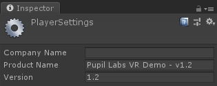
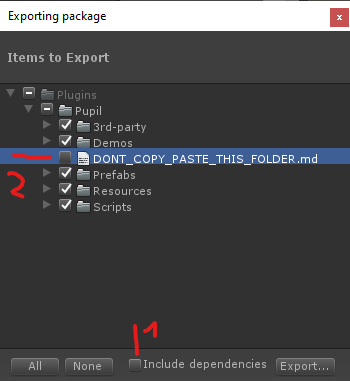
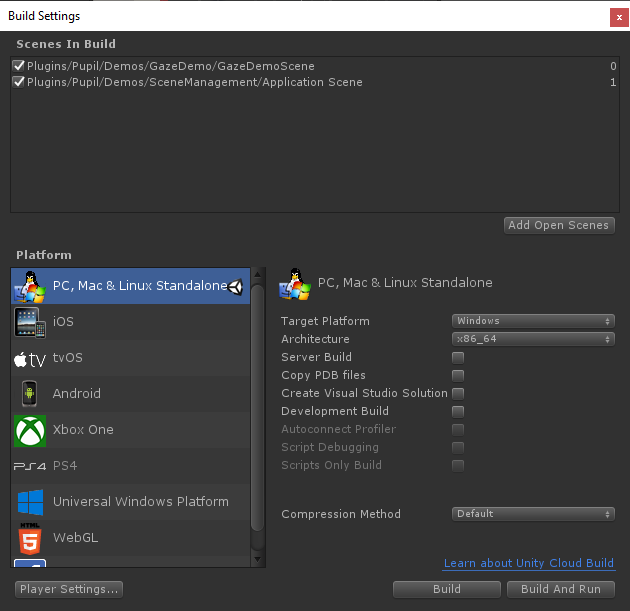

# Maintainer Documentation

## Setting up a deployment project
The contained **starter_project_vr** is set up as the deployment project for creating the final bundles.
You should symlink the plugin into the project with:
```bat
cd starter_project_vr\Assets
mkdir Plugins
mklink /D .\Plugins\Pupil ..\..\plugin
```
Then open the **starter_project_vr** in Unity 2018.4 LTS. 
Make sure you select this version and not the latest version!
Now you can develop while having your code still tracked by git.
Make sure not to make unnecessary changes to the project, as it is also tracked by git.

## Bumping the project version
Besides creating the git tag for a release, you will have to (previously) modify the version string within the deployment project.
For this open the **Player Settings** and adjust the fields **Product Name** and **Version**.



## Creating the unitypackage
In the deployment project, right-click on the **Pupil** folder in **Assets/Plugins** and select **Export Package**.
In the pop-up, untick **Include dependencies** and then untick the **DONT_COPY_PASTE_THIS_FOLDER.md** file in the items list (this order is important!).



Then export the package to the desired location.
The current naming convention is **HMD-Eyes.VR.v{VERSION}.unitypackage**.

## Creating the demo application

In the deployment project, open the **Build Settings**, which should look like this:



Click on **Build**.
In the folder selection popup, move to the desired location and **create a new folder (!)** with the name **3d_gaze_demo_vr_v{VERSION}**.
Select this new folder for the build.
The folder should open afterwards containing the entire application.
Zip the entire folder before uploading to GitHub.

## Upload to GitHub

Create and push a new tag with the new version.
Create a release on GitHub for this tag and fill in the release notes.
Upload assets: the unitypackage and the zipped demo app.