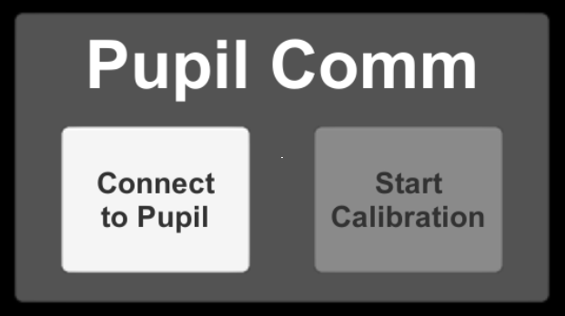

hmd-eyes
========

Building blocks for eye tracking in Augmented Reality `AR`. The purpose of this repository is do demonstrates how to implement Pupil with Unity3D. For details on Pupil computations, please have a look at the related repositories.

## HoloLens Getting Started

1. [HoloLens Add-on setup](https://docs.pupil-labs.com/#hololens-add-on) - Set up the Pupil eye tracking add-on with your HMD and connect it to a PC.
1. [Download Pupil Software](https://github.com/pupil-labs/pupil/releases/latest). Extract the Pupil Capture app to your Desktop.
1. Start Pupil Capture via the `pupil_capture.exe` in the Pupil Capture App folder. A window like this will appear when service is running. Capture does pupil detection from eye images.
1. Select the `Plugin Manager` in `Pupil Capture` and start the `HoloLens Relay` plugin 
1. [Download and install Unity 3D 2017.4 LTS](https://store.unity.com/).
1. [Download the hmd-eyes source code](https://github.com/pupil-labs/hmd-eyes/releases/tag/v0.61). Extract the Unity project sources for HoloLens, located in `unity_pupil_plugin_hololens`.
1. In Unity3d open the `unity_pupil_plugin_hololens` as a project. Double click the `Shark Demo/2D Calibration Demo` to load the scene and open the `Holographic Emulation` tab (`Menu/Window/Holographic Emulation`)
1. In the `Holographic` tab, select `Remote to Device` as `Emulation Mode`
1. Read more about Unity's `Holographic Emulation` [here](https://docs.unity3d.com/550/Documentation/Manual/windowsholographic-emulation.html).
1. Start the `Holographic Remoting Player` on your HoloLens device. Enter the displayed device IP in the `Holographic` tab under `Remote machine`. Click the `Connect` button.
1. Once connected, press `Play` in Unity Editor.
1. Follow the on device instructions to open the menu (double air tap) and select `Connect to Pupil` by looking straight at the button and confirming with a single air tap. 
1. Once the connection between Unity3d and `Pupil Capture` is established two eye windows will open. Use these windows to adjust the eye cameras for good tracking.
1. The `Start Calibration` will now be enabled on the HoloLens display.
1. Calibrate - Start the calibration. Focus your gaze on the displayed marker for each displayed position.
1. After a successful calibration, you should see a rotating 3D model  and a visualization of your gaze 

## Develop, integrate, and extend

Check out the [developer docs](Developer.md) to learn  how to set up dev envirmoment, make changes to code, and integrate with your own Unity3D project.

## Community

Chat with the hmd-eyes community on [Discord](https://discord.gg/PahDtSH).
