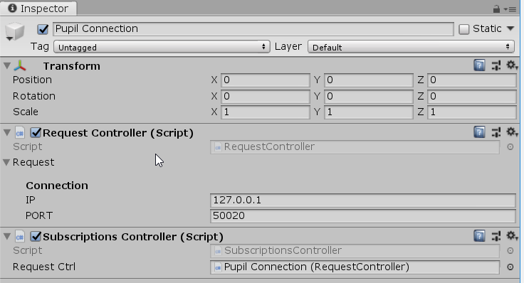

# Developer Documentation

### Pupil Capture/Service

For people new to hmd-eyes, we recommend using the project with [Pupil Capture](https://docs.pupil-labs.com/#pupil-capture). 
It supports recordings and the GUI offers detailed feedback (e.g. pupil detection confidence), which is especially important for gaze tracking or features like blink detection). 

[Pupil Service](https://docs.pupil-labs.com/#pupil-service) features a simplified GUI and a toolset tailored towards low-latency real-time data access.

### Dependencies

* Unity 2018.3 latest
* `ProjectSettings/Player/Configuration/Scripting Runtime Verion` set to **.NET 4.x Equivalent**.
* Due to an issue with MessagePack, the default project setting for `ProjectSettings/Player/Configuration/API Compatibility Level` is not supported and needs to be set to **.NET 4.x**

## Getting Started 

This section of the docs will show you how to set up your development environment in Unity3D so that you can work with Pupil + Unity.

Note that there are difference in the setup for VR and HoloLens.
  
### Adding hmd-eyes to Existing Projects

>Please be aware that for Unity plugins in general to work (especially demo scenes) it is not sufficient to clone and copy paste the plugin/source folder!

Instead HMD-Eyes provides what is called `Unity Package` assets
- `Pupil.Import.Package.VR.unitypackage`
- ~~`Pupil.Import.Package.HoloLens.unitypackage`~~ (TBD)

To import either one in Unity, select `Assets/Import Package/Custom Package...` and navigate to where you downloaded the file to. You are presented with a dialog to choose from the files included in the package. Press `Import` to import all of them. This will create a new folder named `Plugins/Pupil` in your project structure including all necessary scripts and assets to integrate eye tracking with your own project.

Use the demo scenes included in the Unity projects described here as an example on how to get started.

### VR Build and Player Settings


Hmd-eyes provides a `starter_project_vr`. This project is almost identical to the default Unity 3d project and only contains changes in the settings. You still have to install the hmd-eyes plugin as described above.

If you start from a fresh project, you have to make sure that the following settings are set:

* `ProjectSettings/Player/Configuration/Scripting Runtime Verion` = **.NET 4.x Equivalent**.
* `ProjectSettings/Player/Configuration/API Compatibility Level` = **.NET 4.x**

The software has been tested for both Oculus and OpenVR SDKs. Please make sure to select the correct SDK for your headset. 

## Plugin Overview

The plugin architecture consists of three layers
- Pupil Connection (low level api): 

    Connection to Pupil Capture, sending messages and managing subscriptions

- Pupil Communicaton (high level api): 

    High level classes handling the communication and data parsing for specific topics       
- Utility Components:

    Components for visualizing Pupil Capture data or guiding through specific processes


### Component Setup

*TBD*

### Scene Management

Demo: [SceneManagementDemo](#SceneManagementDemo)

*TBD*

## Communicating with Pupil

All demos contain an instance of the `Pupil Connection` prefab. This is the base for communicating with Pupil Capture. 



The `RequestController` handles all messages towards Pupil like starting plugins. Inside the request controller you can change IP&Port, in case of not running Pupil Capture locally or not using the default port *50020*.

The `SubscriptionsController` allows to subscribe based on topics like `pupil`, `gaze` or `blink`. For the most important or more complex topics we provided additional abstraction with listener classes like `GazeListener`, which we introduce later in this document.

Both provide a property for the connection status and `RequestController` also offers C# events for *OnConnect* and *OnDisconnect*

All *Listeners* and high level components need acces to the Pupil Connection object, which is done via the Unity inspector. The demos **BlinkDemo** and **PupilDataDemo** are good starting points for understanding how the communication with Pupil works. 

## Display Eye Images

Demo: [Frame Publishing Demo](#FramePublishingDemo)

To display images of the eyes, we provided a component called `FrameVisualizer`. It is based on the `FrameListener`, which takes care of subscribing to the `frame` topic and provides C# events on receiving eye frame data. The visualizer component displays the eye frames as `Texture2D` as children of the camera. 


## Calibration 

In order to know what someone is looking at in the scene, we must establish a mapping between pupil positions and the gaze point. 

Before you calibrate you will need to ensure that eyes are well captured and that the pupil detection runs with high confidence (~0.8).
Please refer to the Pupil [getting started](https://docs.pupil-labs.com/#capture-workflow) and [user docs](https://docs.pupil-labs.com/#pupil-detection).

Use the `FrameVisualizer` component to check that you are capturing a good image in particular of the pupil of the eye. You may need to adjust the headset to ensure you can see the eye in all ranges of eye movements.


Once the communication between Unity and Pupil Capture has been setup, you are ready to calibrate. 
We provided the `CalibrationController` component, based on the `Calibration` class. The `CalibrationController` guides through the process and acts as an interface, while the `Calibration` itself handles the communication with Pupil Capture.

As all *Listeners* and other high level components the `CalibrationController` needs access to the Pupil Connection object. Additionally assigning the camera object makes sure that the calibration happens in camera space and is independent of head movements. 


### Calibration Settings and Targets

The controller allows to swap different `CalibrationSettings` and `CalibrationTargets`. Both are `ScriptableObjects`, so you can create your own via the *Assets/Create/Pupil* menu or use the default ones inside the *Calibration Resources* folder.


The **Calibration Settings** are currently reduced to time and sample amount per calibration targets:

- `Seconds Per Target` defines the duration per marker position.
- `Ignore Initial Seconds` defines how much time the user is expected to need to move from one calibration marker position to the next. During this period, the gaze positions will not be recorded. 
- `Samples Per Target` defines the amount of calibration points recorded for each marker position. 

The real flexibility lies in the **Calibration Targets**. 

The plugin provides `CircleCalibrationTargets` as a default implementation, which allows to define targets as a list of circles with different *center* and *radii* plus the number of points for every circle. 

On top `CalibrationTargets` and the `CalibrationController` are setup in a way that you can write your own implementation of `CalibrationTargets` and plug them into the controller. Be aware that the controller expects targets in local/camera space and not world coordinates.

### Calibration Success/Failure 

When the calibration process is complete, all reference points are sent to Pupil software. Pupil software will respond with a `success` or `failure` message. `CalibrationController` provides C# events for *OnStarted*, *OnSucceeded* and *OnFailed*.

## Gaze Tracking

Demo: [GazeDemo](#GazeDemo)

The `GazeListener` class takes care of subscribing to all `gaze*` messages and provides C# events containing already parsed `GazeData`. Checkout the public properties of the [GazeData.cs](../plugin/Scripts/GazeData.cs) to see what kind of data is available. Keep in mind that vectors like the `GazeData.GazeDirection` and `GazeData.EyeCenter0/1` are in local VR camera space.

The `GazeVisualizer` component already showcases how to access the `GazeDirection` after checking the confidence. 


The `GazeVisualizer` component needs access to the `CalibrationController` (to start the visualization after a successful calibration) and again access to the Pupil Connection object.

The visualization is using the `GazeData.GazeDirection` to project into the scene via raycasting.

Checkout the `Gaze Controller` prefab to add gaze tracking to your own scenes.

### GazeDirection + GazeDistance instead of GazePoint3d

Instead of directly using the data field `GazeData.GazePoint3d` we recommend to use the equivalent representation as `GazeData.GazeDirection` and `GazeData.GazeDistance` as this representation clearly separates the angular error from the depth error. Note that while the depth error increases with growing distance of the gaze target the direction remains accurate (angular error of less than 2 degrees).

Due to access to 3d informations about the VR environment, the gaze estimation can be enhanced by using the `GazeData.GazeDirection` to project into the scene via [raycasting](https://docs.unity3d.com/ScriptReference/Physics.Raycast.html).

## Accessing Data 

For your own applications you might not want to visualize gaze at all but access it directly. In this case you need to write your own component utilizing the `GazeListener` class similar to the `GazeVisualizer`.

Checkout the public properties of the [GazeData.cs](../plugin/Scripts/GazeData.cs) to see what kind of data is available. Keep in mind that most vectors like `GazeDirection` and `EyeCenter0/1` are local coordinates in VR camera space. 

<!-- The first step to be able to access Pupil data is to subscribe to a topic.

```c#
PupilTools.SubscribeTo(string topic)
```

Once messages on a subscribed topic are available, the receiving socket is polled (`Connection.cs`, [line 199](https://github.com/pupil-labs/hmd-eyes/blob/master/unity_pupil_plugin_vr/Assets/pupil_plugin/Scripts/Networking/Connection.cs#L199))

```c#
if (subscriptionSocketForTopic [keys [i]].HasIn)    // key[i] being the 'topic' 
    subscriptionSocketForTopic [keys [i]].Poll ();
```

Message interpretation is handled inside the code block starting in [line 127](https://github.com/pupil-labs/hmd-eyes/blob/master/unity_pupil_plugin_vr/Assets/pupil_plugin/Scripts/Networking/Connection.cs#L127) of `Connection.cs`

```c#
subscriptionSocketForTopic\[topic\].ReceiveReady += (s, a) =>
```

### `Gaze` Topic (available after successful calibration)

After a successful calibration, `gaze` topic messages will be received. These messages contain dictionaries. These dictionaries are deserialized using the `MessagePackSerializer` classes ([line 167](https://github.com/pupil-labs/hmd-eyes/blob/master/unity_pupil_plugin_vr/Assets/pupil_plugin/Scripts/Networking/Connection.cs#L167), `Connection.cs`) and stored to `PupilTools.gazeDictionary`

```c#
var dictionary = MessagePackSerializer.Deserialize<Dictionary<string,object>> (mStream);  
var confidence = PupilTools.FloatFromDictionary(dictionary,"confidence");  
[..]  
if (confidence > 0.6f && msgType == "gaze")   
    PupilTools.gazeDictionary = dictionary;
```

Changes to `gazeDictionary` trigger 

```c#
PupilTools.UpdateGaze()
```

which goes through the data, storing relevant information (e.g. the gaze positions) through 

```c#
PupilData.AddGazeToEyeData(string key, float[] position)
```
Based on the chosen calibration type, this can either be 2D or 3D. To access the data, use 

- `PupilData._2D.LeftEyePosition`, `PupilData._2D.RightEyePosition` or `PupilData._2D.GazePosition`, which will provide the current viewport coordinates in camera space for the respective eye (used e.g. for the three colored markers) 

- `PupilData._2D.GetEyePosition (Camera sceneCamera, string eyeID)`, which will apply an additional frustum center offset for each eye (used e.g. for the shader implementations) 

- `PupilData._3D.GazePosition`, which contains the camera relative gaze position 

Working with 2D calibration and viewport coordinates, Unity provides methods to translate these to 3D space, e.g. `PupilMarker.UpdatePosition(Vector2 newPosition)`, line 56 

```c#
gameObject.transform.position = camera.ViewportToWorldPoint(position); 
```

An alternative is used by the laser pointer implementation in the `2D Calibration Demo` scene `MarketWith2DCalibration.Update()`, line 63 

```c#
Ray ray = sceneCamera.ViewportPointToRay(viewportPoint); 
```

This solutions requires the use of Unity Colliders, though, which, when hit by the above defined ray, return the 3D hit point position.  -->

### Examples for topics that do not require calibration 

We include three demo scenes that exemplify subscribing to topics to get data for which no calibration is required
- `Blink`,
- `Frame Publishing` (short description below) and 
- `Pupil`, for which we will go into more detail, here: 

One of the most often asked for examples is getting values for pupil diameter.  The steps involved (taken from [`PupilDataDemo.cs`](../plugin/Demos/PupilDataDemo/PupilDataDemo.cs)) are as follows:

- `subsCtrl.SubscribeTo("pupil", CustomReceiveData);`, to subscribe to both eyes

- Once data is being sent

```c#
CustomReceiveData(string topic, Dictionary<string,object> dictionary, byte[] thirdFrame = null)
```
will be called to interpret the result

```c#
if (topic.StartsWith ("pupil") )
{
    foreach (var item in dictionary)
    {
        switch (item.Key)
        {
        case "topic":
        case "method":
        case "id":
            var textForKey = PupilTools.StringFromDictionary (dictionary, item.Key);
            // Do stuff
            break;
        case "confidence":
        case "timestamp":
        case "diameter":
            var valueForKey = PupilTools.FloatFromDictionary (dictionary, item.Key);
            // Do stuff
            break;
``` 

There are multiple subtopics included in the dictionary and as "diameter" is of type `float`, we need to call the following method to get the actual value

```
Helpers.FloatFromDictionary(Dictionary<string,object> source, string key)
```

The script implementation is based on the values you receive for 2D capturing mode. Have a look at [the documentation](https://github.com/pupil-labs/pupil-docs/blob/master/user-docs/data-format.md#looking-at-the-data) to see the additional values available in 3D mode
    
## Recording Data

Demo: [DataRecordingDemo](#DataRecordingDemo)

The Unity VR plugin allows to trigger recordings in Pupil Capture (Pupil Service does not support this feature). 
The `RecordingController` component offers starting and stoping recordings via the inspector or by code using the methods `RecordingController.StartRecording` and `RecordingController.StopRecording` - in either case only once a connection has been established).

We removed the functionality for recording a screen capture in Unity as this recording was incompatible with Pupil Player. 
(We plan to support to stream a screen capture directly to Pupil Capture in the future.) 

<!-- On the plugin side of things, two additional processes are started
- a screen recording, saving the current view to a video file 

- saving Pupil gaze data and their corresponding Unity positions in CSV format using this structure
    - `Timestamp,Identifier,PupilPositionX,PupilPositionY,PupilPositionZ,UnityWorldPositionX,UnityWorldPositionY,UnityWorldPositionZ`

The resulting files are saved to the path set in `PupilSettings/Recorder/File Path`. You can change it manually, there, or through the `PupilGazeTracker` Inspector GUI under `Settings` by activating `CustomPath` and clicking the `Browse` button.  -->

## Demo Scenes 

Here a short description of the included examples and what should be visible on screen.

### Pupil

This example shows you how to subscribe to `pupil.` topics and how to interpret the dictionary that you will receive from Pupil software in Unity.

### Blink 

This demo shows blink events and logs them to the console. This demo does not require calibration as it only uses pupil data (not gaze data).

It demonstrates how to  subscribe to a topic and read data from the socket, start/stop a Pupil plugin, to subscribe and un-subscribe from a topic (e.g. `blinks`), and how to receive a dictionary from Pupil in Unity. 


### FramePublishingDemo

This demo scene shows how to communicate with Pupil and access eye video frames


### GazeDemo

The Gaze Demo showcases the full stack needed for gaze estimations. You start in a simple scene with and after an established connection to Pupil Capture, you can see Eye Frames as a reference to adjust your HMD and use the scene to "warm up" your eyes.

Following the instructions you can start the calibration, which will hide everything and only shows the calibration targets. After a successful calibration the `GazeVisualizer` starts, projecting the gaze estimate into the scene.


### GazeRaysDemo

In contrast to the GazeDemo the GazeRaysDemo is visualizing the gaze vectors of both eyes individually - using `GazeData.GazeNormal0/1` and `GazeData.EyePosition0/1`. 

The demo also takes the `GazeData.GazeMappingContext` into account - to check for which eye the data is available.

### DataRecordingDemo

A simple demo using the `RecordingController` component. The demo script allows starting and stoping the recording by pressing "R".

### SceneManagementDemo

This demo is very similar to GazeDemo but contains of two scenes: the calibration and the application scene. By applying the `DontDestroy` script to our `Pupil Connection` object of the calibration scene, we make sure it is available after switching the scene. 

The scene switch is handled by listening to `CalibrationController.OnCalibrationSucceeded` and the `SetupOnSceneLoad` script in the application scene injects the `Pupil Connection` into the `GazeVisualizer`.

### HoloLens - 2D/3D Calibration Demo 

*TBD*

<!-- As it is not a common use-case for HoloLens to visualize complete scenes, we reduced the market scene to a single object - the `sharkman` - for the user to look at.  -->

### Spherical Video demo

*TBD*

<!-- Load and display a 360 degree video based on Unity's 2017.3 implementation. Combined with Pupil, this allows to visualize what the user is looking at.  -->

### Heatmap demo

*TBD*

<!-- This demo shows how to generate and export spherical videos or still images with heat maps generated from gaze postions.

Gaze positions are visualized as particles on a spherical texture that is overlayed on the 3d scene. 

After calibration, press `h` to start recording the output video or to capture the current view to an image. The output path is the same as the path defined by the settings for PupilGazeTracker recordings. 


- Mode 
    - `Particle` will color the area the user is looking at 
    - `ParticleDebug` will make the hetamap visible for the user wearing the HMD as well as the operator. 
    - `Highlight` will only fill-in the area looked at 
        
    - `Image` will keep all particles and color code them based on the time of creation 
        
    - `Particle Size` - The size of a single particle used to visualize each gaze position 
    - `Remove Particle After X Seconds` - Set how many seconds a particle should be visualized (not used for Image mode) 
    - `Particle Color` - The color of the particle in the visualization 
    - `Particle Color Final` - Color for oldest particle in Image mode. Every color in between will be interpolated 
    
The heatmap is available as Prefab, and can be added to existing scenes by dragging it onto the main camera of that scene. -->
